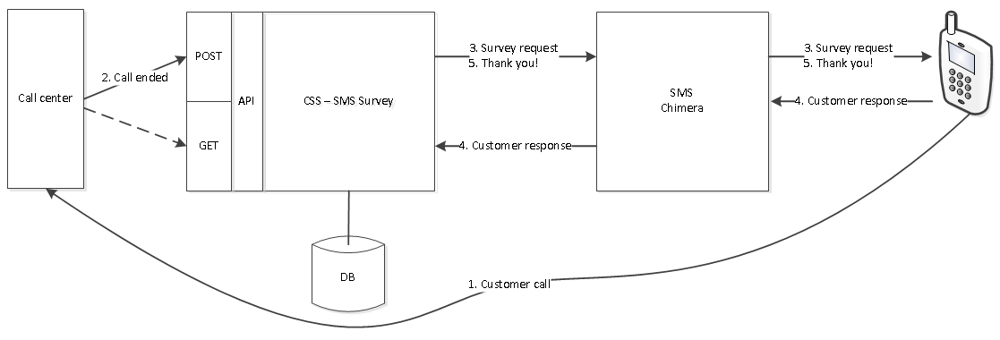

# API for integration
SMS Survey is our own solution for customer satisfaction survey using SMS. 
A survey request can be sent to the  SMS survey application by using either the HTTP POST or HTTP GET method. The overview for the solution is displayed below:

## HTTP POST
 A survey request has to be sent to the following address in order to send a survey SMS to an end user:
<pre><code>http://interactive.intele.com/customersurvey/RequestHandlerServlet</code></pre>
 
Here is an example of the body of a POST request containing the following XML:

<pre><code>&lt;?xml version="1.0" encoding="ISO-8859-1" ?&gt;
&lt;log serviceid="[serviceid]"&gt;
    &lt;caller&gt;
        &lt;queue&gt;[Queue]&lt;/queue&gt;
        &lt;agent&gt;[agent]&lt;/agent&gt;
	&lt;team&gt;[team]&lt;/team&gt;              
	&lt;msisdn&gt;[msisdn]&lt;/msisdn&gt;
	&lt;password&gt;[xxxx]&lt;&lt;/password&gt;
    &lt;/caller&gt;
&lt;/log&gt;
</code></pre>

 the parameters can be optional or mandatory and the value in bracket must be substituted:

POST with extra parameter:
<pre><code>&lt;?xml version="1.0" encoding="ISO-8859-1" ?&gt;
&lt;log serviceid="[serviceid]"&gt;
  &lt;caller&gt;
    &lt;queue&gt;[queue]&lt;/queue&gt;
    &lt;agent>[agent]&lt;/agent&gt;
    &lt;team>[team]&lt;/team&gt;              
    &lt;msisdn>[msisdn]&lt;/msisdn&gt;
    &lt;password>[xxxx]&lt;/password&gt;
    &lt;Parameter1>[xxxx]&lt;/Parameter1&gt;
    &lt;Parameter2>[xxxx]&lt;/Parameter2&gt;
    &lt;Parameter3>[xxxx]&lt;/Parameter3&gt;
    &lt;Parameter4>[xxxx]&lt;/Parameter4&gt;
    &lt;Parameter5>[xxxx]&lt;/Parameter5&gt;
  &lt;/caller&gt;
&lt;/log&gt;
</code></pre>

### Parameter
<table>
<tr><th>Parameter</th><th>Data Type</th><th>Description</th><th></th></tr>	
<tr><td>serviceid</td><td>String</td><td>SMSSurvey service's unique identifier</td><td>mandatory</td></tr>
<tr><td>queue</td><td>String</td><td>Identifier for queue</td><td>optional</td></tr>	
<tr><td>agent</td><td>String</td><td>Identifier for agent</td><td>optional</td></tr>
<tr><td>team</td><td>String</td><td>Identifier for team</td><td>optional</td></tr>
<tr><td>msisdn</td><td>String</td><td>valid cellphone number which the survey SMS will be sent to</td><td>mandatory</td></tr>	
<tr><td>password</td><td>String</td><td>SMSSurvey service's password</td><td>mandatory</td></tr>	
</table>

### Extra parameters
<table>
<tr><th>Parameter</th><th>Data Type</th><th>Description</th><th></th></tr>
<tr><td>Parameter 1</td><td>String</td><td>Ex.: call wait time</td><td>optional</td></tr>	
<tr><td>Parameter 2</td><td>String</td><td>Ex.: call duration</td><td>optional</td></tr>
<tr><td>Parameter 3</td><td>String</td><td></td><td>optional</td></tr>	
<tr><td>Parameter 4</td><td>String</td><td></td><td>optional</td></tr>
<tr><td>Parameter 5</td><td>String</td><td></td><td>optional</td></tr>
</table>

### It can be defined up to 5 extra parameters.
Extra parameters must be registered at Puzzel in order to be displayed and must be sent in the same order as defined. Please URL encode parameters containing spaces with %20, for example: parameter 1 = call%20wait%20time, parameter 2= call%20duration.

### Request
Content-Type is set to 'text/xml; charset=ISO-8859-1'

### HTTP POST Request
 <pre><code>POST http://80.232.75.135/customersurvey/RequestHandlerServlet HTTP/1.1
Content-Type: text/xml; charset=ISO-8859-1
Host: 80.232.75.135
Content-Length: 214

&lt;?xml version="1.0" encoding="ISO-8859-1" ?&gt;
&lt;log serviceid="2106"&gt;
    &lt;caller&gt;
        &lt;queue&gt;queue1&lt;/queue&gt;
        &lt;agent&gt;agent1&lt;/agent&gt;
	&lt;team&gt;team1&lt;/team&gt;              
	&lt;msisdn&gt;90937954&lt;/msisdn&gt;
	&lt;password&gt;xxxx&lt;&lt;/password&gt;
    &lt;/caller&gt;
&lt;/log&gt;
</code></pre>

### Eksempel med ekstra parameters
 <pre><code>POST http://80.232.75.135/customersurvey/RequestHandlerServlet HTTP/1.1
Content-Type: text/xml; charset=ISO-8859-1
Host: 80.232.75.135
Content-Length: 214

&lt;?xml version="1.0" encoding="ISO-8859-1" ?&gt;
&lt;log serviceid="2106"&gt;
    &lt;caller&gt;
        &lt;queue&gt;queue1&lt;/queue&gt;
        &lt;agent&gt;agent1&lt;/agent&gt;
	&lt;team&gt;team1&lt;/team&gt;              
	&lt;msisdn&gt;90937954&lt;/msisdn&gt;
	&lt;password&gt;xxxx&lt;&lt;/password&gt;
	&lt;waittime&gt;xxxx&lt;&lt;/waittime&gt;
	&lt;callduration&gt;xxxx&lt;&lt;/callduration&gt;
    &lt;/caller&gt;
&lt;/log&gt;
</code></pre>

### Response
The server responds with 200 OK HTTP status code indicating the request has succeeded.
### HTTP POST Response
<pre><code>HTTP/1.1 200 OK
Server: Apache-Coyote/1.1
X-Powered-By: Servlet 2.4; JBoss-4.0.4.GA (build: CVSTag=JBoss_4_0_4_GA date=200605151000)/Tomcat-5.5
Content-Type: text/html;charset=ISO-8859-1
Date: Wed, 10 Apr 2013 06:45:56 GMT
Content-Length: 238

&lt;!DOCTYPE HTML PUBLIC "-//W3C//DTD HTML 4.01 Transitional//EN"&gt;
&lt;HTML&gt;
  &lt;HEAD&gt;&lt;TITLE&gt;A Servlet&lt;/TITLE&gt;&lt;/HEAD&gt;
  &lt;BODY&gt;
    This is class customer.satisfaction.survey.handler.RequestHandler, using the POST method
  &lt;/BODY&gt;
&lt;/HTML&gt;
</code></pre>

### HTTP GET
A survey request can be sent to the  SMS survey application by using the following URL: 
<pre><code>http://interactive.intele.com/customersurvey/RequestHandlerServlet?serviceid=2106&queue=1&agentid=1&msisdn=99999999&password=xxxx&customer_key=customer&user_id=xxxxx&related_iq_session=session</code></pre>

### Parameter
<table>
<tr><th>Parameter</th><th>Data Type</th><th>Description</th><th></th></tr>	
<tr><td>serviceid</td><td>String</td><td>SMSSurvey service's unique identifier</td><td>mandatory</td></tr>
<tr><td>queue</td><td>String</td><td>Identifier for queue</td><td>optional</td></tr>	
<tr><td>agent</td><td>String</td><td>Identifier for agent</td><td>optional</td></tr>
<tr><td>team</td><td>String</td><td>Identifier for team</td><td>optional</td></tr>
<tr><td>msisdn</td><td>String</td><td>Valid cellphone number which the survey SMS will be sent to</td><td>mandatory</td></tr>	
<tr><td>password</td><td>String</td><td>SMSSurvey service's password</td><td>mandatory</td></tr>
<tr><td>customer_key</td><td>String</td><td>Identifier for Connect customer (valid only for Intelecom Connect customers)</td><td>optional</td></tr>
<tr><td>user_id</td><td>String</td><td>Identifier for Connect user (valid only for Intelecom Connect customers)</td><td>optional</td></tr>	
<tr><td>related_iq_session</td><td>String</td><td>Identifier for Connect iq session (valid only for Intelecom Connect customers)</td><td>optional</td></tr>	
</table>

### Extra parameters
<table>
<tr><th>Parameter</th><th>Data Type</th><th>Description</th><th></th></tr>
<tr><td>Parameter 1</td><td>String</td><td>Ex.: call wait time</td><td>optional</td></tr>	
<tr><td>Parameter 2</td><td>String</td><td>Ex.: call duration</td><td>optional</td></tr>
<tr><td>Parameter 3</td><td>String</td><td></td><td>optional</td></tr>	
<tr><td>Parameter 4</td><td>String</td><td></td><td>optional</td></tr>
<tr><td>Parameter 5</td><td>String</td><td></td><td>optional</td></tr>
</table>

### It can be defined up to 5 extra parameters.

Extra parameters must be registered at Puzzel in order to be displayed and must be sent in the same order as defined. Please URL encode parameters containing spaces with %20, for example: parameter 1 = call%20wait%20time, parameter 2= call%20duration.

### Request
### HTTP GET Request
<pre><code>GET http://interactive.intele.com/customersurvey/RequestHandlerServlet?serviceid=XXXX&queue=1&agentid=1&team=1&msisdn=99999999&password=XXXX&customer_key=customer&user_id=xxxxx&related_iq_session=session

HTTP/1.1
Host: interactive.intele.com
</code></pre>

### Request med ekstra parameter
<pre><code>GET http://interactive.intele.com/customersurvey/RequestHandlerServlet?serviceid=XXXX&queue=1&agentid=1&team=1&msisdn=99999999&password=XXXX&customer_key=customer&user_id=xxxxx&related_iq_session=session&call%20wait%20time=xxxx&call%20duration=xxxx

HTTP/1.1
Host: interactive.intele.com
</code></pre>

### GET live score
<pre><code>Your application must support the HTTP GET method.
Send your URL (location of your server application) to support.interactive@intele.com
For example: http://foo.com/yourapplication
</code></pre>
### Retrieving query string values

<pre><code>Our SMS application will send a GET request to your server application at the specified URL.
For example: http://foo.com/yourapplication?date=[date]&msisdn=[originator]&agentid=[agent]&queue=[queue]&team=[team]&score=[end user score]
Your server application can retrieve the values from the query string.
</code></pre>

### Response
The server responds with 200 OK HTTP status code indicating the request has succeeded.
### HTTP GET Response
<pre><code>HTTP/1.1 200 OK
Server: Apache-Coyote/1.1
X-Powered-By: Servlet 2.4; JBoss-4.0.4.GA (build: CVSTag=JBoss_4_0_4_GA date=200605151000)/Tomcat-5.5
Content-Type: text/html;charset=ISO-8859-1
Date: Wed, 10 Apr 2013 12:08:44 GMT
Content-Length: 237

&lt;!DOCTYPE HTML PUBLIC "-//W3C//DTD HTML 4.01 Transitional//EN"&gt;
&lt;HTML&gt;
  &lt;HEAD&gt;&lt;TITLE&gt;A Servlet&lt;/TITLE&gt;&lt;/HEAD&gt;
  &lt;BODY&gt;
    This is class customer.satisfaction.survey.handler.RequestHandler, using the GET method
  &lt;/BODY&gt;
&lt;/HTML&gt;
</code></pre>

 

